# CS-358a Project: Ratatoskr (Micromouse)

Team members: Leoluca Bernardi, Leonardo Bolognese, Ali Gorgani, Mattia Metzler, Anthony Tamberg

<p align="center"></p>

<p align="center">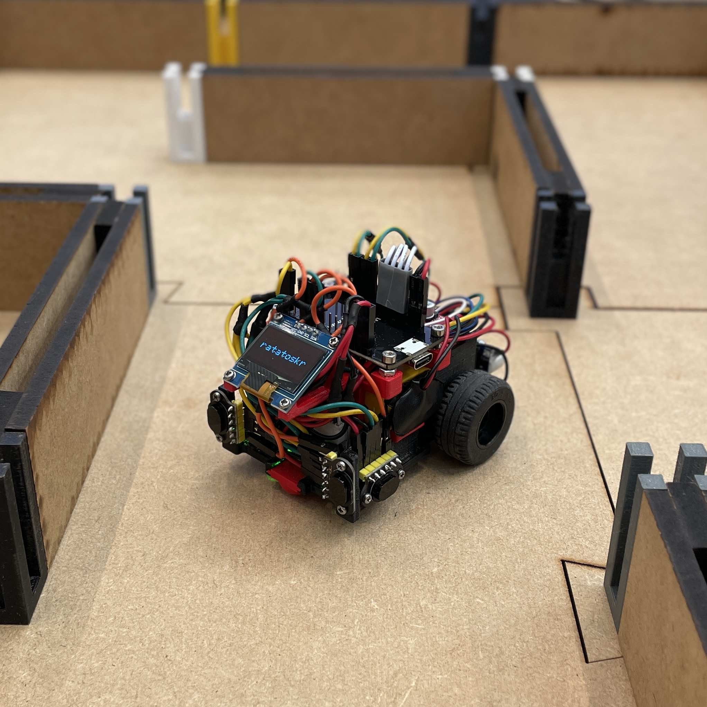</p>

## Table of Contents

<!-- mtoc-start -->

* [Introduction](#introduction)
  * [Inspiration and References](#inspiration-and-references)
* [Design](#design)
  * [Hardware](#hardware)
    * [Schematic](#schematic)
  * [Firmware and Software](#firmware-and-software)
    * [Firmware](#firmware)
    * [Software and Logic](#software-and-logic)
  * [The Maze](#the-maze)
* [Assembly](#assembly)
  * [3D-printing](#3d-printing)
  * [Soldering](#soldering)
  * [Chassis](#chassis)
  * [Drivetrain and Housing](#drivetrain-and-housing)
  * [Battery and ESP32 Mount](#battery-and-esp32-mount)
  * [OLED Mount](#oled-mount)
  * [Wiring, Motor driver and Power Supply](#wiring-motor-driver-and-power-supply)
    * [Communication Cable Trees](#communication-cable-trees)
    * [Battery Connector, Buck Converter and Motor Driver](#battery-connector-buck-converter-and-motor-driver)
    * [ESP32](#esp32)
    * [XSHUT Cables](#xshut-cables)
* [Software Setup](#software-setup)
  * [PIO Setup](#pio-setup)
  * [MMS Setup](#mms-setup)

<!-- mtoc-end -->

<br>

## Introduction

Ratatoskr is a small autonomous robotic 'micromouse' that can find the fastest path through a maze.
In two separate `search` and `run` phases, the mouse first finds the most optimal path and then traverses it, doing
both in the shortest possible time. In this project we designed a compact micromouse capable of traversing a maze
smoothly, precisely, and efficiently, allowing it to take diagonal paths during the final `run`.  
Below is a video showing both these phases. The start is at the top left and the goal is at the bottom right. The `run`
phase starts once the mouse has returned back to the start.

https://github.com/user-attachments/assets/25bfac3e-31b9-44ee-8b9a-028d77b7232d

### Inspiration and References

This project is inspired by the micromice of a previous iteration of the course, specifically
[MinosMouse](https://github.com/epfl-cs358/2024fa-minosmouse) and
[PicoMouse](https://github.com/epfl-cs358/2024fa-picomouse). We used their projects to get an idea of the needed
components and the general layout of the software.  
We also used parts of their maze for convenience and to save on resources and waste, because remaking these would
use a lot of material and time. There is more about this in the maze section.

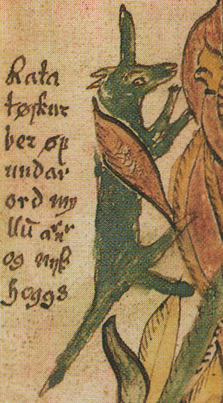
Finally, the name 'Ratatoskr' comes from Norse mythology and refers to a squirrel that runs through the world-tree
Yggdrasil, carrying messages. We found this name to be quite fitting for our project, as Ratatoskr is one of the only
creatures capable of navigating the complex interior of Yggdrasil.
For your enjoyment, here is an image from a 17<sup>th</sup> icelandic manuscript depicting Ratatoskr, taken from Wikipedia
(public domain).

<p></p>
<br>

## Design

By design, most parts of Ratatoskr are fully 3D-printable, with the remaining parts being common Lego pieces.  
The final Micromouse weighs approximately 190g, it is 7cm wide and about 10cm long. About a quarter of the weight comes
from the 9V battery used to power it.

### Hardware

Ratatoskr requires the following electronic and mechanical components:
| Component                                  | Quantity | Notes                                                                                        |
|--------------------------------------------|----------|----------------------------------------------------------------------------------------------|
| N20 DC gear motor w/ encoder and connector | 2        | Working RPMs: 500, 750, 300[^1]                                                              |
| MX1508 motor driver                        | 1        | -                                                                                            |
| ESP32 development kit                      | 1        | **30-pin** version, higher should be fine                                                    |
| LM2596 buck converter                      | 1        | -                                                                                            |
| VL53L1X time-of-flight sensor              | 4        | Also known as `TOF400C`                                                                      |
| MPU-6050 3-axis accelerometer w/ gyroscope | 1        | -                                                                                            |
| SSD1306 OLED screen                        | 1        | These come in multiple colors, we used hybrid yellow-blue                                    |
| 9V (PP3) battery w/ connector              | 1        | We recommend using good quality batteries for this, as the current should be somewhat stable |
| LEGO(r) 58090 Tire 30.4 x 14 Solid         | 2        | Other tires of approximately the same size should work                                       |
| LEGO(r) 3705 Technic Axle 4L               | 2        | -                                                                                            |

[^1]: Not tested, but should work given the torque and speed requirements

#### Schematic

Below is the full electronics schematic of ratatoskr.

<p align="center">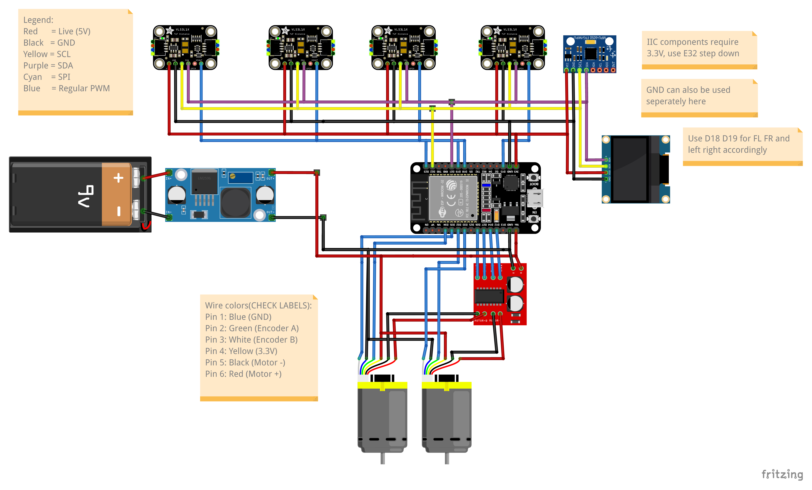</p>
Note that the exact pinout of the components might differ depending on the manufacturer and version of each part.

### Firmware and Software

Below follows a very brief overview of how the software for Ratatoskr works. For more details look at the source code :wink:

#### Firmware

We use the following libraries to simplify the hardware interfaces:

| Library                                                                   | Used for                 |
| ------------------------------------------------------------------------- | ------------------------ |
| [pololu/VL53L1X](https://github.com/pololu/vl53l1x-arduino)               | ToF sensors              |
| [ronny-antoon/NVSDatabase](https://github.com/ronny-antoon/DatabaseAPI)   | Flash storage database   |
| [adafruit/Adafruit_SSD1306](https://github.com/adafruit/Adafruit_SSD1306) | OLED screen              |
| [robjen/GFX_fonts](https://github.com/robjen/GFX_fonts)                   | Font for the OLED screen |

Additionally, we use [PlatformIO](https://platformio.org/) to compile the source code for the ESP32 and to handle all
the libraries above. See [PIO Setup](#pio-setup) for more details.

All sensors communicate with the ESP over the I<sup>2</sup>C protocol because the components can be assigned to
different addresses. As a result, we can use the same SDA and SCL pins for them. ToF sensors additionally require an extra pin for some XSHUT logic. The OLED is also controlled via I<sup>2</sup>C.  
There are C++ classes for most components that handle all their low-level functionality and provide a clean, high-level
interface for interacting with them.

#### Software and Logic

To make testing easier we use [MMS](https://github.com/mackorone/mms), a micromouse simulator. It allows us to test the
higher level code that handles solving a maze and calculating the final run without physically needing to run Ratatoskr
in a maze.

<p align="center"><video src='https://github.com/user-attachments/assets/aed72121-12ea-4d18-b9f5-ffeec3736798' height=100 width=100/></video></p>

Ratatoskr uses _principal-integral-derivative_ (PID) controllers to generate precise and stable movement. These
controllers continually adjust the motor power based on sensor feedback, allowing the micromouse to correct itself on the
fly. There are three PID systems in total:

1. Motor encoders: ensure that both wheels spin at the same, correct rate allowing for controlled acceleration.
2. Side ToF sensors: ensure the mouse stays centered between the walls and generally positions itself correctly in the
   maze.
3. Front ToF sensors: ensure that the mouse stays centered during diagonals and detect the end of diagonals.

To find the best path in the maze, Ratatoskr uses a floodfill algorithm while regularly updating its image of the maze
using the sensors. The best path is then computed from a Dijkstra graph constructed from this information. The Dijkstra
algorithm is tuned to favor diagonals over turns. This path is finally further optimized to combine multiple forward
movements into one so that Ratatoskr does not stop at every cell.

Documentation can be accessed by running `make docs` at project root. By using [Doxygen](https://www.doxygen.nl/index.html)
and a [CSS extension](https://github.com/jothepro/doxygen-awesome-css/tree/1f3620084ff75734ed192101acf40e9dff01d848) all
function headers get collected into a nice multipage format including function headers, descriptions, and call-graphs.

### The Maze

The maze we use for Ratatoskr uses the same wall pieces and mounting posts designed by the previous year's micromice teams, although with a newly
designed tiled floor. The posts are 3D-printed with a pocket for an M2.5 nut. The walls and baseplates are lasercut
from MDF.  
As a sidenote, it probably would have been better to redesign the posts and walls because they are not easy
to assemble and use. However, to save resources and time, we decided to go with the existing ones.  
To mount the posts to the baseplates, use M2.5 flathead screws, which can be countersunk to the underside of
the baseplates with a tapered (hand) drill. The walls are simply slid in between the posts.

The baseplates are designed to interlock like puzzle tiles, eliminating the need for complex mounting

Below is a technical drawing of a maze baseplate.

<p align="center">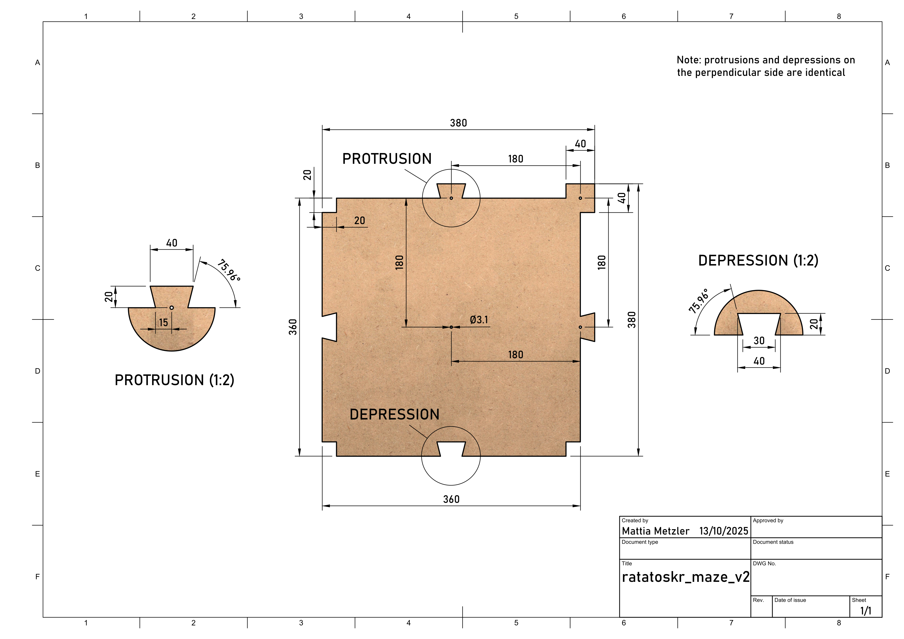</p>

<br>

## Assembly

To assemble Ratatoskr, the following additional hardware is needed:

| Item                     | Quantity | Note                                                   |
| ------------------------ | -------- | ------------------------------------------------------ |
| M2.5 threaded inserts    | 6        | 4x for ESP32 mount, 2x for chassis                     |
| 2.5mm washers            | 6        | Used to increase mount height of gyro                  |
| 5mm washers              | 2        | Used to reduce friction between wheel and chassis      |
| M2.5 nuts                | 6        | 2x for gyro, 4x for ESP32 mount                        |
| M2.5 10mm machine screws | 8        | 2x for battery holder, 2x for gyro, 4x for ESP32 mount |
| M2.5 5mm machine screws  | 3        | 2x for buck converter, 1x for motor driver             |
| M2 5mm machine screws    | 12       | 2x for each ToF sensor, 4x for OLED                    |

In addition:

- Various jumper cables, depending on the amount of serviceability desired.
- An additional M2.5 5mm machine screw to screw through the hole on the ball caster, although this is not strictly needed.

### 3D-printing

The following STL files need to be 3D-printed:

| STL file                          | Quantity | Description and Notes                                                                     |
| --------------------------------- | -------- | ----------------------------------------------------------------------------------------- |
| `./CAD/STL/miter_gear.stl`        | 4        | Drivetrain gears                                                                          |
| `./CAD/STL/lego_adapter_v2b.stl`  | 2        | Motor shaft adapters, **brim recommended**                                                |
| `./CAD/STL/screen_mount.stl`      | 2        | OLED screen mounts, **brim needed**                                                       |
| `./CAD/STL/v2/ball_caster.stl`    | 1        | Ball caster, **Supports recommended**                                                     |
| `./CAD/STL/v2/battery_clip.stl`   | 1        | Battery clip                                                                              |
| `./CAD/STL/v2/battery_holder.stl` | 1        | Battery holder, **Supports needed**                                                       |
| `./CAD/STL/v2/chassis_cutout.stl` | 1        | Latest, Lightest ver. of chassis, **supports needed for axle holes and sidewall cutouts** |
| `./CAD/STL/v2/middle_shelf.stl`   | 1        | Shelf to mount gyro on                                                                    |
| `./CAD/STL/v2/top_shelf.stl`      | 1        | Shelf to mount motor driver on                                                            |

It is recommended to print all parts on Prusa MK4 printers, splitting the job into two prints: the chassis and the
remaining components.  
After that is done, heat-set the threaded inserts into the battery holder and the chassis:

<p align="center">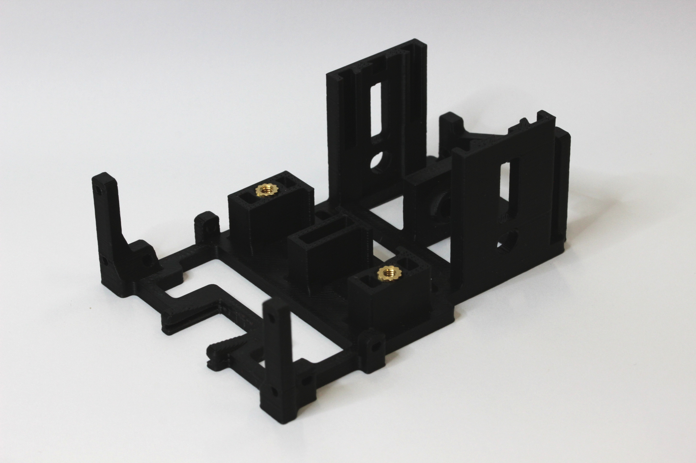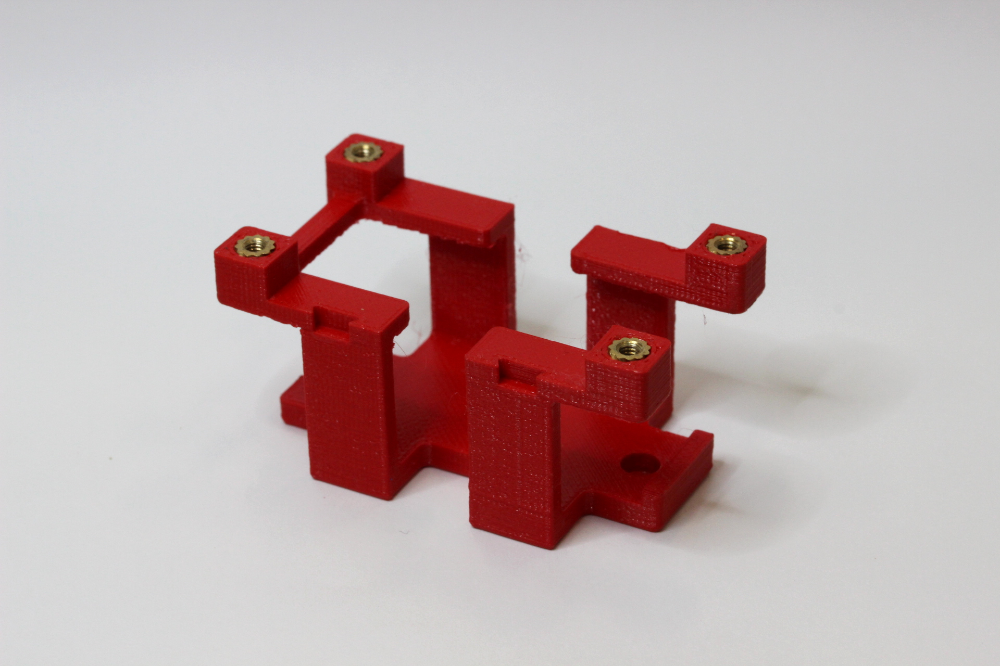</p>

### Soldering

Solder the pin headers to the OLED, the ToF sensors and the gyroscope. Use the bent headers for the ToF and the gyro,
inserting them from below for the ToFs and from above for the gyro. Bending the OLED headers inwards slightly helps.  
For more details see photos further below.

### Chassis

Insert the inverted (!) ball-caster into the cutout in the front. You will probably have to sand this quite a bit, as
it is designed to be press-fit.  
Mount the ToF sensors as shown below to the chassis using 2x M2 5mm screws each.

<p align="center">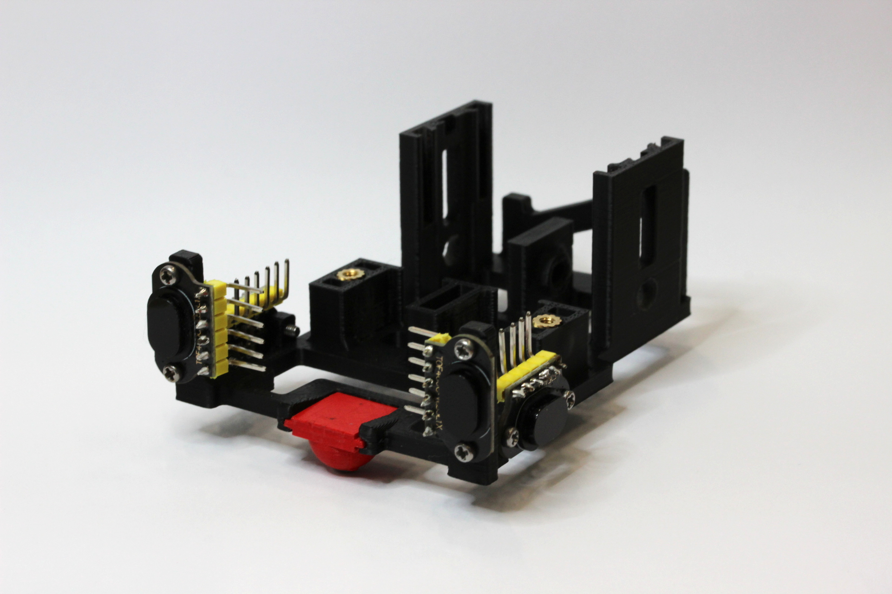</p>

### Drivetrain and Housing

Screw the gyro to the middle shelf of the drivetrain housing making sure to put three (3) washers between the underside
of the gyro and the shelf, and a nut at the underside of the shelf. Use 2x M2.5 10mm screws. Take note of the
orientation of the gyro in the picture below -- the back edge of the gyro should be aligned with the edge of the shelf.  
Then slide the shelf down the rails in the drivetrain housing. Again, you will probably need to sand/file some things here.

<p align="center">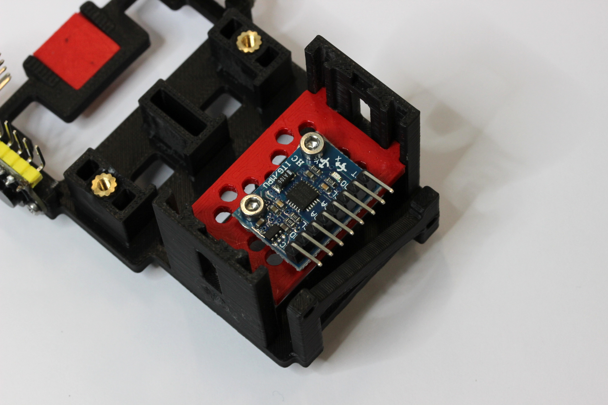</p>

Put one adapter over each motor shaft and slide on a gear. Insert the LEGO axles into the assembled wheels, put the
washer on top and slide them through the axle holes in the chassis, while simultaneously putting in the second set of
gears. This step is somewhat tricky but well doable with some pliers or tweezers.  
Before doing this, you need to file down the insides of the axle holes (including the holder in the middle) to make sure
the wheels turn freely. This is again somewhat finnicky but well doable with a small round file.

<p align="center">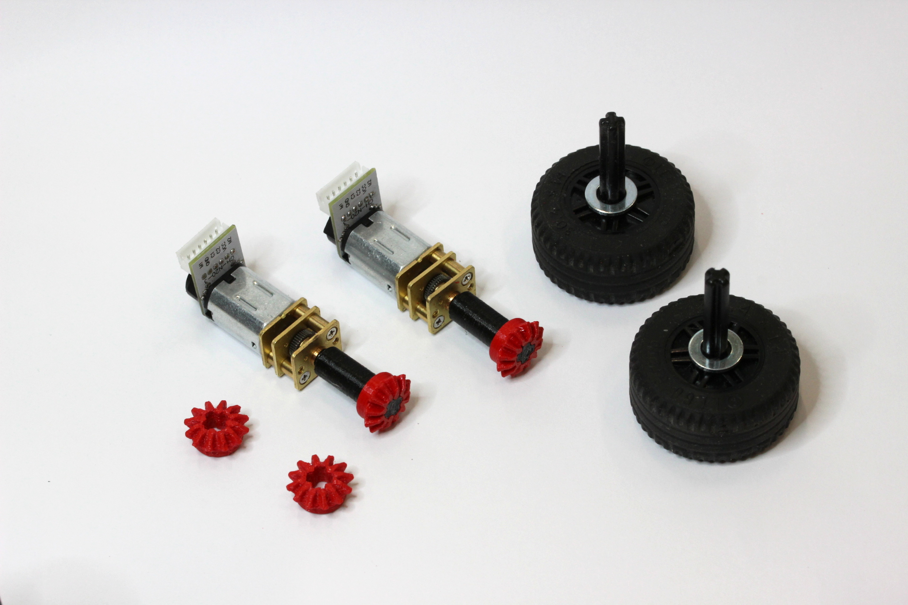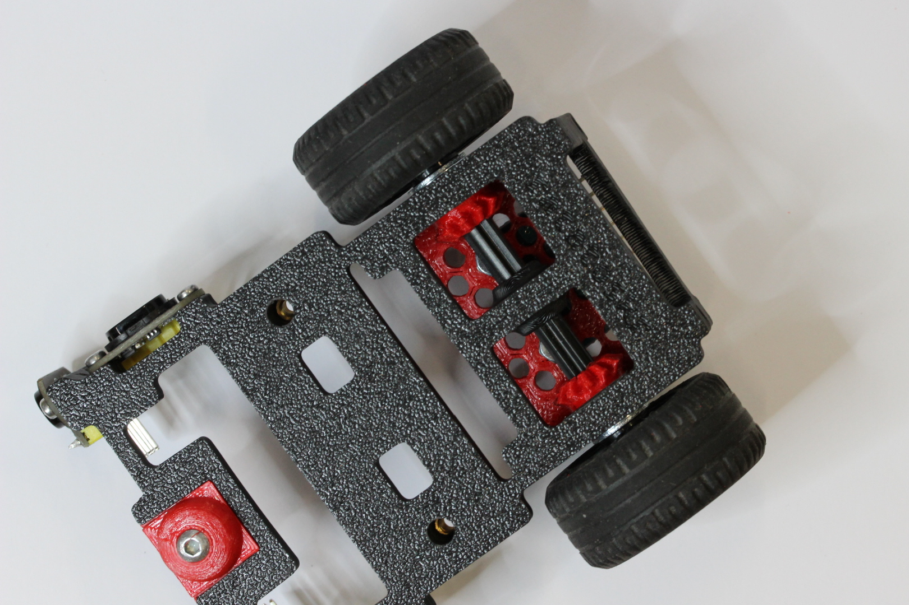</p>

Finally, insert the motors as shown below. You might need to turn the wheels a bit so the gears mesh well.

<p align="center">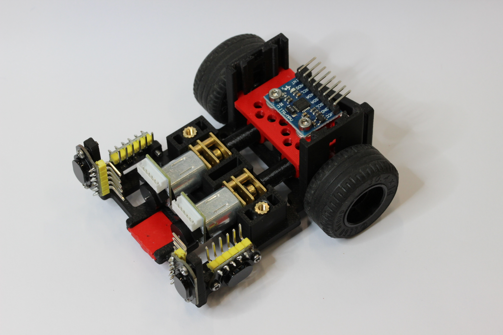</p>

### Battery and ESP32 Mount

Use 2x M2.5 10mm screws to screw the battery holder to the chassis using the previously installed threaded inserts. Make
sure to orient the battery holder correctly, the cutouts for the OLED mounts should be facing forwards. Alternatively,
check that the little connecting bar on one side of the battery holder faces the right-hand side.  
Also make sure that the screws are inserted all the way, i.e. the heads should sink into the cutouts made for them.

At this point you can slide in the battery and secure it from behind using the little clip.

<p align="center">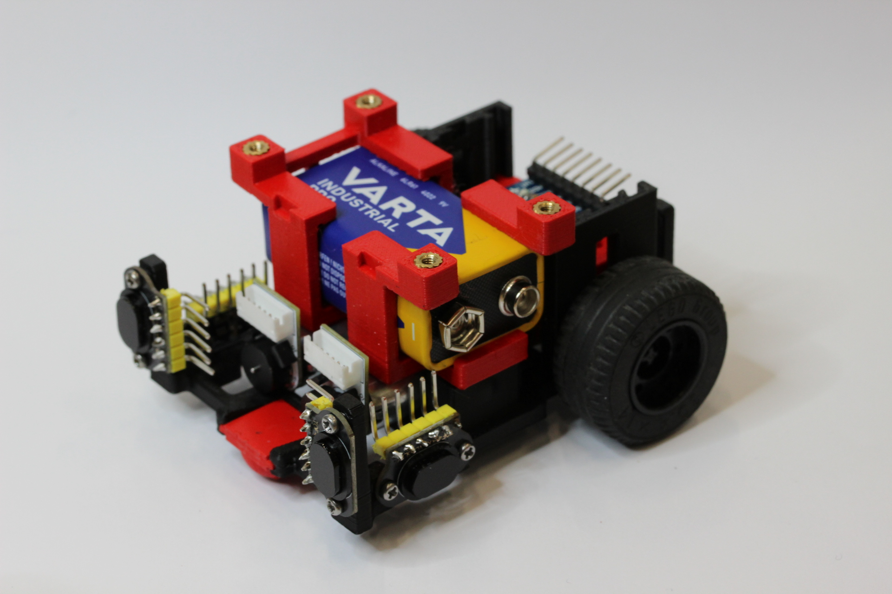</p>

### OLED Mount

Using 4x M2 5mm screws, screw the OLED mounts to the OLED board like in the below photo:

<p align="center">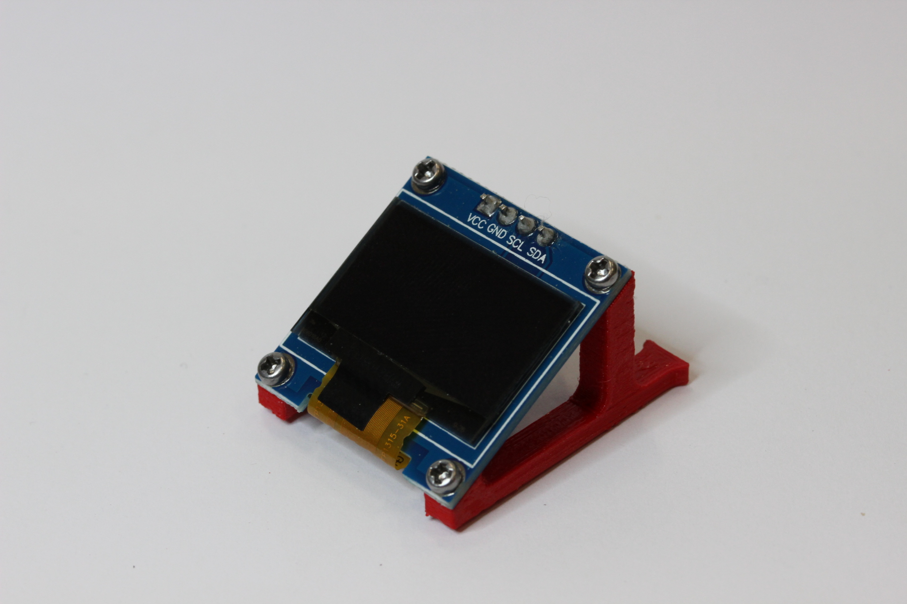</p>

### Wiring, Motor driver and Power Supply

Now for the hard part! :wink:

#### Communication Cable Trees

You need to wire **four** (4) cable trees with female dupont connectors for the
I<sup>2</sup>C communication as follows:

- four (4) connectors for the ToF sensors
- one (1) connector each for the gyro and the OLED

Therefore you need (6) female connectors in total, first split into two, one for ToFs/OLED and one for gyro, the former
then further split into five.  
We recommend keeping the colors between the trees different so they are easier to tell apart, as in the photos below.

> [!WARNING]
> It is crucial to make these cables the right length. Too short and you won't be able to connect the components, too long
> and there will not be enough space in the mouse to put all the cables. Measure the cables before you cut them by
> dry-fitting them on the mouse.

<p align="center">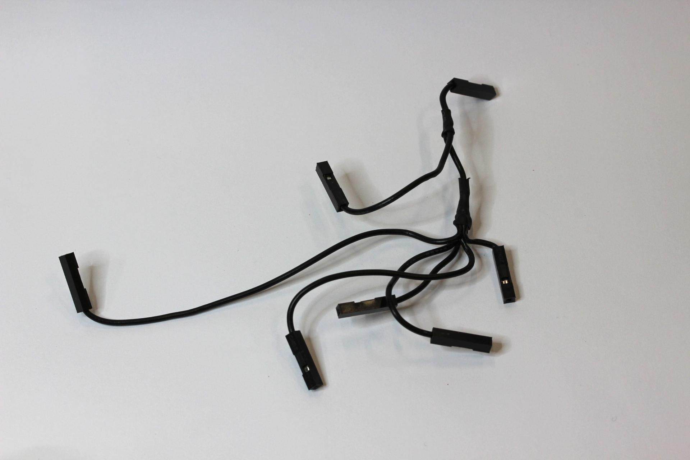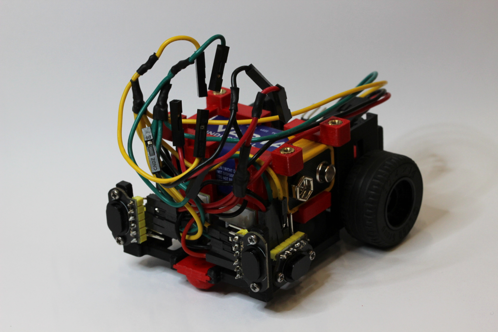</p>

The four down-facing unused connectors in the above picture are used for the OLED screen, which can also be mounted now
by sliding it into the cutouts on the battery holder.

#### Battery Connector, Buck Converter and Motor Driver

The buck converters `IN +` and `IN -` pads need to be soldered to the power (red) and ground (black) cables of the
battery connector respectively. Then, with a multimeter connected to the `OUT +` and `OUT -` pads, the brass screw on
the buck converter needs to be turned (probably counter-clockwise) until the voltage read is around 5V. The LED on the
buck converter should light up quite strongly when the battery is connected.

Then wire up **two** (2) cable trees for 5V and GND going from one cable to four each. As the power wires need to be
reliable, these should be soldered directly, not using Dupont connectors. Thus only add Dupont connectors to one of the
four cables, namely the one for the ESP32.  
Then wire the other three cables to the motor drivers and the motors directly. Finish soldering the motor driver as shown
on the [schematic](#schematic).  
The encoder and motor input cables should also end in Dupont connectors to connect to the ESP32.

<p align="center">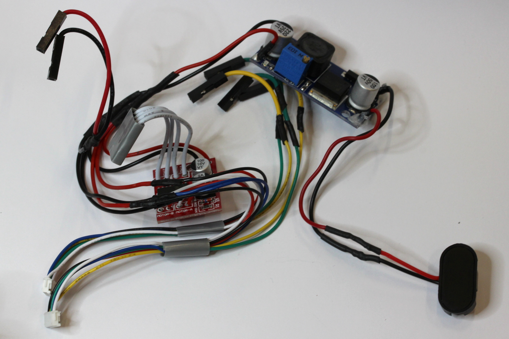</p>

Finally, mount all of this to the mouse, making sure that the motors are plugged in correctly. To do so, first mount
the motor driver to the top shelf using 1x M2.5 5mm screw. The buck converter is attached using the 2x M2.5 5mm screws.

#### ESP32

Now you can finally connect the ESP32 by screwing it **upside-down** into the threaded inserts. Then connect all
previous cables as specified on the schematic.

#### XSHUT Cables

The last step is to solder some short cables for the XSHUT pins on the ToF sensors. These should be just long enough to
connect, but not be too long as they might not have enough space otherwise.

And you are done! Enjoy your finished micromouse! :smile:

<p align="center">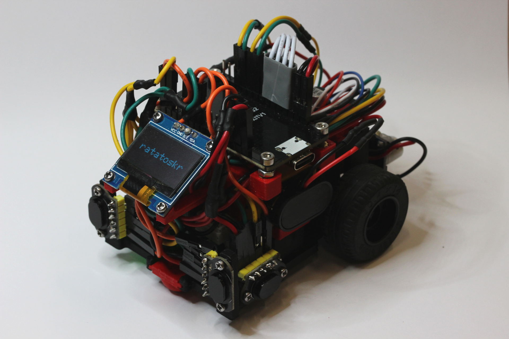</p>

## Software Setup

### PIO Setup

The [`platformio.ini`](./platformio.ini) file specifies the environment of the project, telling PlatformIO the
microcontroller and the libraries needed for compilation and flashing. The easiest way of interacting with PlatformIO is their
[CLI](https://docs.platformio.org/en/latest/core/index.html) which is used as follows:

- Compile the project
    ```sh
    pio run
    ```
- Upload the project to the ESP32
    ```sh
    pio run --target upload
    ```
- Open the serial monitor
    ```sh
    pio device monitor
    ```

All of these commands need to be run from the root directory of this repository.

> [!WARNING]
> Before doing anything for the first time, run
>
> ```sh
> pio run --target compiledb
> ```
>
> from the command-line in the root directory to generate `compile_commands.json` which tells `gcc/clang` how to compile
> everything.

### MMS Setup

To set up MMS, you first need to download the version of MMS corresponding to your operating system on the [MMS releases page](https://github.com/mackorone/mms/releases).

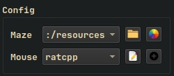

At the top right of your MMS window, you will find a box titled _Config_.

- Press the `+` button to create a new configuration.
    - Choose any _Name_
    - Choose the project root directory for the _Directory_ field
    - Enter `make sim` as _Build Command_
    - Enter `./out/sim.out` as _Run Command_
    - Click ok
- The button with the color wheel is a simple way to adjust the colors of the simulation.

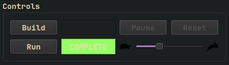

Now you are ready to run the simulation.

- Press the `Build` button to compile the mouse code.
- Press the `Run` button to make it start.
    - Moving the scale from :turtle: to :rabbit: will increase the speed.

> [!WARNING]
> If you are using windows, a unix dependency may cause an error.
>
> To fix this, change line 6 of `virtual_mouse.cpp` from `#include <unistd.h>` to `#include <windows.h>`
